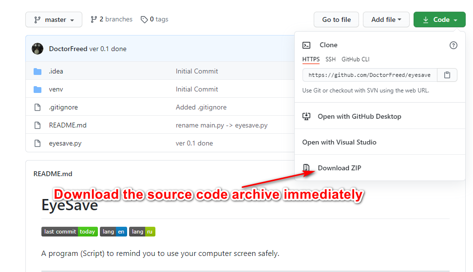

# EyeSave


A program (Script) to remind you to use your computer screen safely.
____
# Requirements
Interpreter: Python3

:heavy_exclamation_mark: Additional package: playsound
____

# Installation

### Installing additional packages

Install the playsound add-on package from your system's console by writing the following command:
```
    pip install playsound
```
### Just download

Download the file eyesave.py 

### or clone the repository
```
   git clone https://github.com/DoctorFreed/eyesave.git
```

____
# Usage
```
python eyesave.py -h
usage: eyesave.py [-h] [-s SESSION] [-p PAUSE] [-c COUNT]

EyeSave - script for eye safety 
https://github.com/DoctorFreed/eyesave

optional arguments:
  -h, --help            show this help message and exit
  -s SESSION, --session SESSION
                        the time you will be working at the computer (in minutes)
  -p PAUSE, --pause PAUSE
                        time that you will rest (in minutes)
  -c COUNT, --count COUNT
                        the number of sessions that the program will run, 
                        one session is one cycle of work and rest.
```


