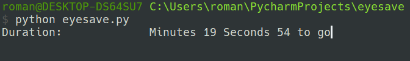

# EyeSave


A program (Script) to remind you to use your computer screen safely.
____
# Requirements
Interpreter: Python3

:heavy_exclamation_mark: Additional package: playsound
____

# Installation

### Installing additional packages

Install the playsound add-on package from your system's console by writing the following command:
```
    pip install playsound
```
### Just download

Download the file eyesave.py 

### or clone the repository
```
   git clone https://github.com/DoctorFreed/eyesave.git
```

____
# Usage
```
python eyesave.py -h
usage: eyesave.py [-h] [-s SESSION] [-p PAUSE] [-c COUNT]

EyeSave - script for eye safety 
https://github.com/DoctorFreed/eyesave

optional arguments:
  -h, --help            show this help message and exit
  -s SESSION, --session SESSION
                        the time you will be working at the computer (in minutes)
  -p PAUSE, --pause PAUSE
                        time that you will rest (in minutes)
  -c COUNT, --count COUNT
                        the number of sessions that the program will run, 
                        one session is one cycle of work and rest.
```

## Examples

Use with default settings, 20 minutes of work, 5 minutes of rest from the screen.
```
   python eyesave.py
```


### Custom parameters
For example, you want to put your own version of time of work and rest, in this case you must use such arguments as '-s' is that '-p' is a relaxation time.

Let's take an example like 40 minutes of work and 10 minutes of rest.
```
   python eyesave.py -s 40 -p 10
```


It is also possible to specify the number of sessions of work, for one session is considered work+rest.

To do this, use the '-c ' parameter. for example, we want to run a script with five sessions
```
   python eyesave.py -s 40 -p 10 -с 5
```
At the end of all sessions, the script will be disabled.

#TODO
- [ ] Add the ability to use custom sounds.
- [ ] To make Russian localization


